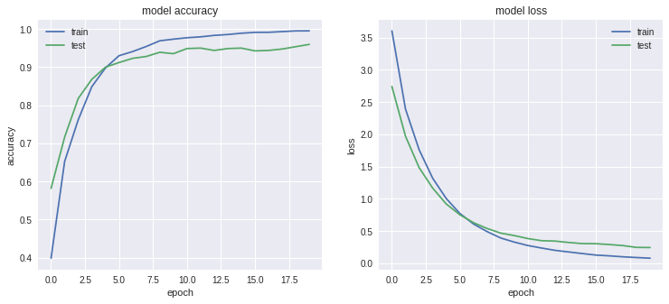
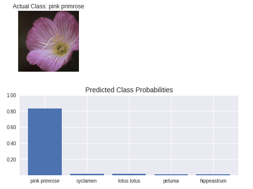

# PyTorch Image Classification Project
<div style="text-align: justify">
This is a personal project I built to explore the use of PyTorch as well as deep learning techniques for computer vision such as <i>Image Augmentation</i> and <i>Transfer Learning</i>. These techniques will be explained in detail in the later sections.
</div>

### Image Augmentation
<div style="text-align: justify">
Before loading the data, I will be performing image augmentation on my image dataset through transformations such as shearing, scaling and flipping. By augmenting the image dataset, we are able to add more data to our training set and hence produce more robust models.
</div>

```python
# Define transforms for training, validation and testing sets
data_transforms = {
  'train': transforms.Compose([
    transforms.Resize((224,224)),
    transforms.RandomAffine(0, shear=10, scale=(0.8,1.2)),
    transforms.RandomHorizontalFlip(),
    transforms.ToTensor(),
    transforms.Normalize([0.485, 0.456, 0.406], [0.229, 0.224, 0.225])
  ]),
  'validation': transforms.Compose([
    transforms.Resize((224,224)),
    transforms.ToTensor(),
    transforms.Normalize([0.485, 0.456, 0.406], [0.229, 0.224, 0.225])
  ])
}
```

### Initialize DataLoaders
To load the data, I initialized PyTorch's DataLoader which will generate our image data in batches. The image transformation will also be performed concurrently in this step.
```python
# Initialize Image Datasets with Transformations
image_datasets = {
  'train': datasets.ImageFolder(train_dir, data_transforms['train']),
  'validation': datasets.ImageFolder(valid_dir, data_transforms['validation'])
}

# Initialize DataLoaders
dataloaders = {
  'train': torch.utils.data.DataLoader(
    image_datasets['train'],
    batch_size=32,
    shuffle=True,
    num_workers=4
  ),
  'validation': torch.utils.data.DataLoader(
    image_datasets['validation'],
    batch_size=32,
    shuffle=False,
    num_workers=4
  )
}
```

### Building the Classifier
<div style="text-align: justify">
The classification model I am building leverages on the <i>Transfer Learning</i> technique. This technique utilizes pre-trained models that were trained on massive amount of images (<i>e.g. ResNet152, VGG19</i>) as the foundation. By leveraging on this technique, I am able to overcome the speed and time limitations of training a huge neural network on massive amount of data.
</div>


<div style="text-align: justify">
The image above is an example of a typical <i>Convolutional Neural Network (CNN) Architecture</i>. The <i>ResNet152</i> model architecture is a variation of CNN which performs  feature learning/extraction. I then design a <i>Multi-Layer Perceptron (MLP)</i> that takes the extracted features as input to perform classification tasks (e.g. Flower image recognition).
</div>

```python
# Use GPU for faster training
device = torch.device("cuda:0" if torch.cuda.is_available() else "cpu")

# Initialize pre-trained model
model = models.resnet152(pretrained=True).to(device)

# Freeze model layers
for param in model.parameters():
  param.requires_grad = False

# Build MLP on top of pre-trained model
model.fc = nn.Sequential(
  nn.Linear(2048, 1600),
  nn.ReLU(inplace=True),
  nn.Linear(1600, 1024),
  nn.ReLU(inplace=True),
  nn.Dropout(0.1),
  nn.Linear(1024, 102)
).to(device)

# Define loss function for multi-class classification
criterion = nn.CrossEntropyLoss()

# Define Optimizer
optimizer = optim.Adam(model.fc.parameters(), lr=0.001) 
```

### Training the Classifier
A deep neural network is trained by performing an optimization function called *gradient descent*, that adjusts weights according to the error made at each iteration. 
```python
# Perform Train and Validation at each iteration
for phase in ['train', 'validation']:
  if phase == 'train':
    model.train()
  else:
    model.eval()

  running_loss = 0.0
  running_corrects = 0

  for inputs, labels in dataloaders[phase]:
    inputs = inputs.cuda().to(device)
    labels = labels.cuda().to(device)

    # Calculate loss of model output against labels
    outputs = model(inputs)
    loss = criterion(outputs, labels)

    # Perform gradient descent
    if phase == 'train':
      optimizer.zero_grad()
      loss.backward()
      optimizer.step()

    # Calculate loss and accuracy for each batch
    _, preds = torch.max(outputs, 1)
    running_loss += loss.item() * inputs.size(0)
    running_corrects += torch.sum(preds == labels.data)

  # Calculate total loss and accuracy for each iteration
  epoch_loss = running_loss / len(image_datasets[phase])
  epoch_acc = running_corrects.double() / len(image_datasets[phase])

  # Print model loss and accuracy for each iteration
  print('{} loss: {:.4f}, acc: {:.4f}'.format(phase, epoch_loss, epoch_acc))
```

### Model Evaluation
After training for 20 epochs, the model's performance goes as high as *96% in accuracy*. Based on the plot of the model's training, the training accuracy is as high as its test accuracy. This shows that the model is neither overfitting nor underfitting and is able to generalize well to similar flower images.
```python
# Evaluation
correct = 0
total = 0
with torch.no_grad():
    model.eval()
    for inputs, labels in dataloaders['validation']:
        inputs = inputs.cuda().to(device)
        labels = labels.cuda().to(device)
        outputs = model(inputs)

        # Get class prediction
        _, predicted = torch.max(outputs.data, 1)
        # Update total size (Increment batch size)
        total += labels.size(0)
        # Calculate number of correct predictions
        correct += (predicted == labels).sum().item()

# Print accuracy of network on validation dataset
print('Accuracy of the network on the test images: %d %%' % (
  100 * correct / total))

# Output: 
# Accuracy of the network on the test images: 96%
```


### Inference for Classification
<div style="text-align: justify">
The following screenshot is an example of an inference made by my classification model. It returns an output of probability of the top 5 classes the image belongs to. As shown in the screenshot below, the model is able to accurately identify the <i>pink primrose</i> flower image (highest predicted class probability: <i>pink primrose</i>). 
</div>

